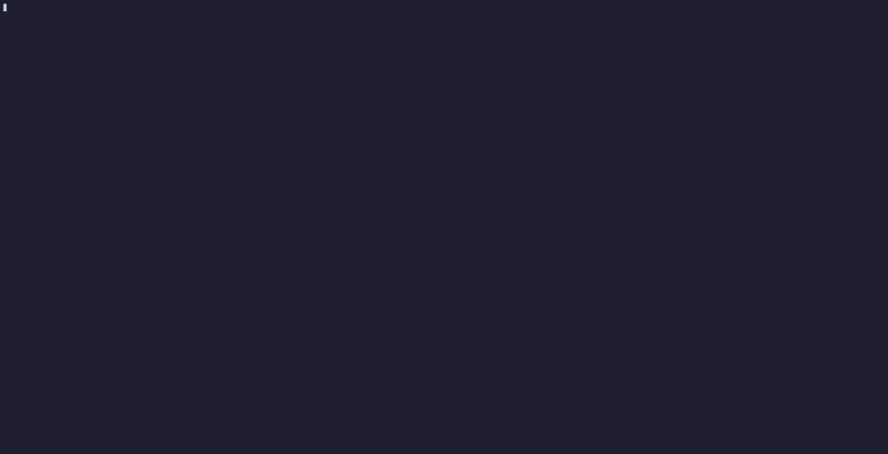

 # Terminal Screensaver

A simple terminal screensaver inspired by [Omarchy](https://omarchy.org/), powered by [Terminal Text Effects](https://github.com/ChrisBuilds/terminaltexteffects).

<br>

<p align="center">
  
  <i>* and many more effects (plays all TTE effects in random order)</i>
</p>

<br>

## Features

- Random terminal animations
- Runs entirely in the terminal
- Press **any key** to exit
- No GUI or desktop environment required

<br>

## Requirements

- Bash
- Python & `pipx`
- [Terminal Text Effects](https://github.com/ChrisBuilds/terminaltexteffects)

<br>

## Installation

Install `pipx` and Python if you don't already have it.

Then install Terminal Text Effects:

```bash
pipx install terminaltexteffects
```

Make the screensaver executable:

```bash
chmod +x screensaver.sh
```

<br>

## Usage

Run: 

```bash
./screensaver.sh
```

Press **any key** to exit.

<br>

## Customizing

The screensaver reads its ASCII artwork from `ascii.txt` in the directory. 
Edit that file to change what is displayed.

> **Note:** I'm also planning to make an Omarchy's font ASCII generator!

<br>

## Credits

- Inspired by [Omarchy](https://omarchy.org/)
- Animations powered by [Terminal Text Effects](https://github.com/ChrisBuilds/terminaltexteffects)
